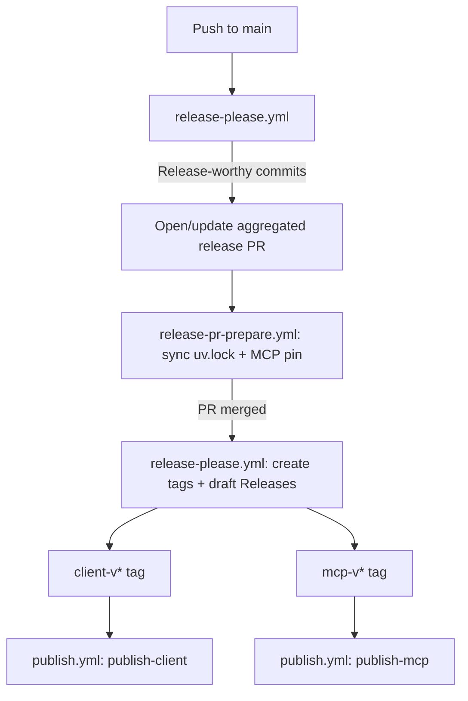

# Release Process

This repo publishes two independently-versioned Python packages —
`stocktrim-openapi-client` (the generated API client, at the repo root) and
`stocktrim-mcp-server` (the MCP server, in `stocktrim_mcp_server/`) — using
[release-please](https://github.com/googleapis/release-please) in manifest mode.
release-please owns versioning, changelogs, and tagging; it does not publish packages
itself.

## The three workflows

(Not linked below: workflow files and the release-please config/manifest sit outside the
docs tree, and mkdocs-built links to them would 404 on the deployed site. Browse them
directly in the repo: `.github/workflows/`, `release-please-config.json`,
`.release-please-manifest.json`.)

- **`release-please.yml`** — the only workflow that watches pushes to `main`. Reads
  `release-please-config.json` and `.release-please-manifest.json` and either
  opens/updates **one aggregated release PR** covering both packages
  (`separate-pull-requests: false`), or — if that PR was just merged — creates a
  `client-v*`/`mcp-v*` tag and a **draft** GitHub Release per changed package at the
  merge commit. It never pushes to `main` itself.
- **`release-pr-prepare.yml`** — runs only on release-please's own PR branch
  (`release-please--branches--main`, matched by prefix). Resyncs `uv.lock` and keeps
  `stocktrim_mcp_server/pyproject.toml`'s `stocktrim-openapi-client>=X` floor (and the
  MCP server's own `__version__`, belt-and-braces alongside `extra-files`) equal to the
  client version the PR proposes — see
  [Inter-package pinning](#inter-package-pinning-issue-238) below. Commits land on the
  release PR branch, never on `main`.
- **`publish.yml`** — the only workflow that builds and ships. Triggered exclusively by
  `client-v*`/`mcp-v*` tag pushes (i.e. only after a release PR merges). Builds the
  package, publishes it to PyPI via OIDC Trusted Publishing, attaches the build
  artifacts (and, for the MCP server, the `.mcpb` bundle) to the still-draft release,
  then flips the release out of draft.

## Draft -> upload -> publish asset flow

release-please creates GitHub Releases as **drafts** (`"draft": true` in
`release-please-config.json`). Draft releases accept asset uploads; once published a
release becomes
[immutable](https://docs.github.com/en/code-security/concepts/supply-chain-security/immutable-releases)
and permanently rejects further uploads — this is exactly the failure mode issue #237
hit when `python-semantic-release` published the `mcp-v0.16.0` release before the
`.mcpb` bundle existed. `publish.yml`'s jobs always: build the artifact(s), publish to
PyPI, `gh release upload <tag> <files> --clobber` onto the still-draft release, then
`gh release edit <tag> --draft=false`. A release is never finalized before its assets
exist.

Unlike the old `release.yml` (which had `build-mcpb` create the `mcp-v*` release itself
via `gh release create <tag> <file> --title ... --notes-file ...`, because PSR had
already bumped the version but explicitly skipped `vcs_release`), release-please now
creates the release — with its notes — directly. `publish-mcp` only needs to attach
assets to the release release-please already made; there's no changelog-extraction step
anymore.

## Inter-package pinning (issue #238)

`stocktrim_mcp_server/pyproject.toml` depends on `stocktrim-openapi-client>=X.Y.Z` — a
**floor**, not an exact pin, and not a capped range (`>=X.Y.Z,<X+1`). release-please has
no built-in concept of inter-package version pinning; `release-pr-prepare.yml` is the
glue that keeps it truthful, rewriting the floor to match the client version on every
release PR.

Floor-only was chosen over the alternatives for two reasons:

- **A capped range (`>=X.Y.Z,<X+1`) adds automation surface for marginal benefit here.**
  `release-pr-prepare.yml` already re-derives the floor from scratch every release
  cycle, so the floor is never more than one cycle stale regardless of whether it's
  capped. A cap would need its own upkeep (bumping the ceiling alongside the floor)
  without meaningfully changing the failure mode it guards against, since a genuine
  breaking client change would need an MCP-side fix and release regardless of what the
  dependency metadata says.
- **An exact pin (`==X.Y.Z`, what the old `Update MCP client dependency` step in
  `release.yml` wrote when it ran) forces an MCP release on every client release**, even
  when nothing MCP-relevant changed. Under release-please's path-based partitioning (see
  below) a client-only commit no longer touches `stocktrim_mcp_server/`, so nothing
  would trigger that companion MCP release automatically — an exact pin would just make
  the previously-published MCP package's metadata stale immediately, which is worse than
  a floor being one release behind.

This matches the floor-only convention adopted in the sibling repos
(`statuspro-openapi-client`, `frontapp-openapi-client`) for the same class of bug (see
statuspro#63, frontapp#165).

Before this migration, the committed dependency had **no constraint at all** (issue
#238) — the old workflow's pin-rewrite step only ran, and only landed on `main`, when
the client itself released in the same run; otherwise whatever was committed (no
constraint) is what shipped. A correct committed default plus automation that fixes it
every cycle, rather than conditionally, closes that gap.

## Bump-semantics change (behavioral)

`python-semantic-release` partitioned commits by **scope** — `(client)`/`(mcp)` in the
commit message decided which package bumped. release-please partitions by **path** —
which files a commit touches decides which package(s) bump. A commit that touches both
`stocktrim_mcp_server/` and the client root now bumps both packages, even without an
`(mcp)` scope; conversely a `(client)`-scoped commit that happens to touch nothing under
the client's tracked paths won't bump the client. Commit scopes remain useful for
changelog grouping/readability but are no longer load-bearing for version decisions.

## Manual prerequisites

None — unlike a from-scratch migration, `stocktrim-openapi-client` and
`stocktrim-mcp-server` already have working PyPI Trusted Publishers from before this
migration, and the `dougborg-release-please` GitHub App (ID `4392719`) was already
configured on this repo. No new secrets, variables, environments, or Trusted Publisher
registrations are required.

## Troubleshooting

**No release PR appears after merging to `main`:** confirm the merged commit's
conventional-commit type is release-worthy (`feat`, `fix`, `perf`) and touches a
configured package path (`.` or `stocktrim_mcp_server/`). `docs:`/`chore:`/`ci:` commits
are recorded in the (hidden) changelog sections but don't bump a version on their own.

**`uv.lock` or the MCP pin looks stale on the release PR:** check the
`release-pr-prepare.yml` run for that PR — it only fires on `release-please--*`
branches. If it didn't run or failed, re-push to the PR branch to retrigger it
(`synchronize` event) or push a fix commit directly.

**Publish fails at the PyPI step:** verify the Trusted Publisher config on PyPI still
lists `publish.yml` and the correct job name (`publish-client`/`publish-mcp`) for the
tag that was pushed.

**Release stuck in draft:** `publish.yml`'s asset-upload or PyPI-publish step failed
before reaching `gh release edit --draft=false`. Check the run logs for that tag; a
draft release can be safely re-run once the underlying failure is fixed, since draft
releases are still mutable.
